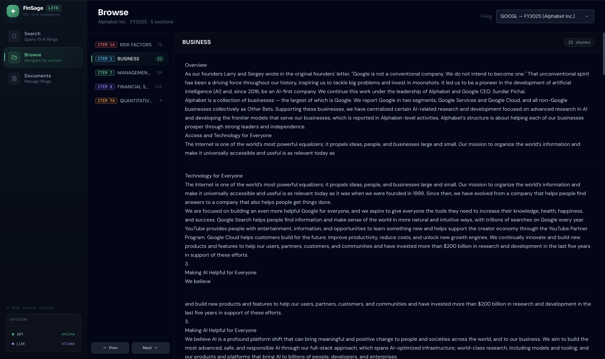
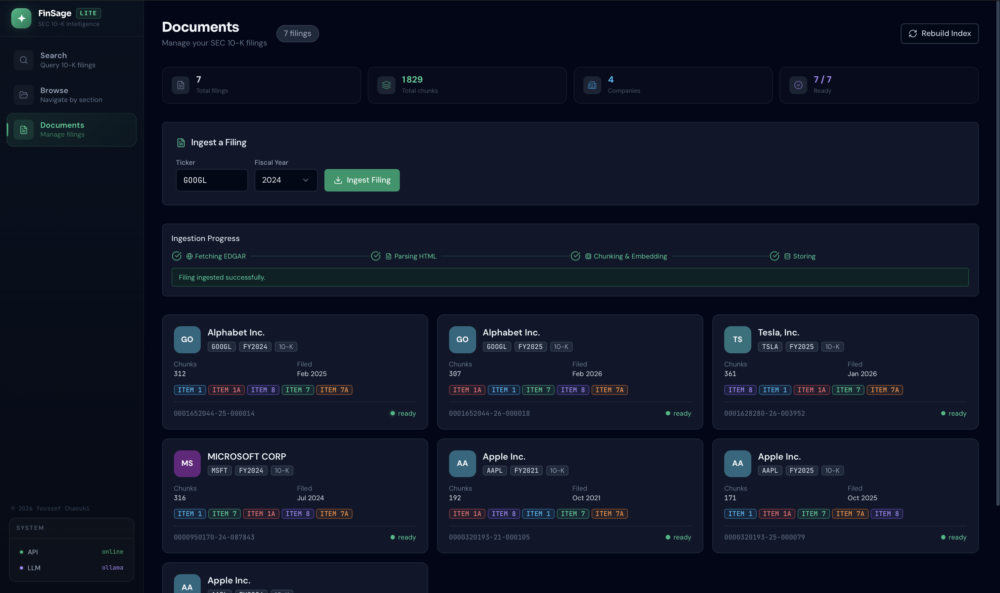

# FinSage-Lite

[](https://github.com/YoussefChaouki/finsage-lite/actions/workflows/ci.yml)
[](https://www.python.org/downloads/)
[](LICENSE)
[](docker-compose.yml)

SEC 10-K filing analysis system with hybrid retrieval (BM25 + dense vectors + RRF), local LLM synthesis via Ollama, and a production-ready React frontend.

---

## Screenshots

| Search | Browse |
|--------|--------|
|  |  |

| Browse content | Documents |
|----------------|-----------|
|  |  |

---

## Quick Start

```bash
# 1 — Clone
git clone https://github.com/YoussefChaouki/finsage-lite.git
cd finsage-lite

# 2 — Configure
cp .env.example .env
# Edit .env: set EDGAR_USER_AGENT to "YourApp yourname@email.com" (required by SEC)

# 3 — Start services (FastAPI + PostgreSQL + pgvector + Ollama)
make docker-up

# 4 — Ingest demo filings, then open the UI
make seed
open http://localhost:5173
```

| Service      | URL                       |
|--------------|---------------------------|
| Frontend     | http://localhost:5173     |
| API          | http://localhost:8000     |
| API docs     | http://localhost:8000/docs |

---

## Architecture

```
                           ┌─────────────────────────────────┐
                           │         React Frontend           │
                           │  Search · Browse · Documents     │
                           │  Zustand + TanStack Query        │
                           └──────────────┬──────────────────┘
                                          │ HTTP (REST)
                           ┌──────────────▼──────────────────┐
                           │         FastAPI  (async)         │
                           │  /search  /documents  /health   │
                           └──────┬──────────────┬───────────┘
                                  │              │
               ┌──────────────────▼──┐    ┌──────▼──────────────────┐
               │   Hybrid Retrieval  │    │   LLM Generation        │
               │                     │    │   Ollama · Mistral       │
               │  BM25 (in-memory)   │    │   (optional, graceful   │
               │  + pgvector cosine  │    │    degradation)         │
               │  + RRF fusion       │    └─────────────────────────┘
               └──────────┬──────────┘
                          │
          ┌───────────────▼────────────────────┐
          │           PostgreSQL + pgvector     │
          │  documents · chunks (384-dim emb)  │
          └───────────────┬────────────────────┘
                          │
          ┌───────────────▼────────────────────┐
          │           Ingestion Pipeline        │
          │  EDGAR API → HTML parse →           │
          │  section-aware chunking →           │
          │  MiniLM-L6-v2 embeddings           │
          └────────────────────────────────────┘
```

**Chunking**: 220-token windows, 50-token overlap, dual content fields (`content_raw` for BM25, `content_context` prefixed for dense).  
**Retrieval**: RRF fusion with k=60, scores normalised to [0, 1].  
**HyDE**: Optional query expansion for analytical queries; falls back to original query if Ollama is unavailable.

---

## Tech Stack

| Layer | Technology |
|-------|------------|
| **Frontend** | React 19 + Vite 6 |
| **UI components** | shadcn/ui + Radix UI |
| **Styling** | Tailwind CSS 3 (dark theme) |
| **Animations** | Framer Motion 12 |
| **State** | Zustand + TanStack Query v5 |
| **API** | FastAPI + Uvicorn |
| **Database** | PostgreSQL 16 + pgvector |
| **Embeddings** | sentence-transformers `all-MiniLM-L6-v2` (384-dim) |
| **ORM** | SQLAlchemy 2.0 async (asyncpg) |
| **Migrations** | Alembic |
| **Sparse search** | rank-bm25 (in-memory, rebuilt on startup) |
| **HTML parsing** | BeautifulSoup4 + lxml |
| **LLM (optional)** | Ollama (Mistral) |
| **Containerisation** | Docker Compose |

---

## Project Structure

```
src/                            # FastAPI backend
├── api/routers/                # health, document, search endpoints
├── clients/edgar.py            # SEC EDGAR HTTP client (async)
├── core/                       # config, database, logging
├── models/                     # SQLAlchemy ORM (documents, chunks)
├── repositories/               # DB access layer
├── schemas/                    # Pydantic request/response models
└── services/                   # ingestion, chunking, embedding,
                                #   search, generation, HyDE, BM25

frontend/src/                   # React frontend
├── components/
│   ├── browse/                 # FilingSelector, SectionNav, SectionContent
│   ├── documents/              # FilingCard, IngestForm, IngestProgress
│   ├── search/                 # SearchBar, SourceCard, AnswerPanel, CitationChip
│   └── ui/                     # shadcn/ui + custom primitives
├── hooks/                      # useSearch, useBrowse, useDocuments, useIngest
├── pages/                      # SearchPage, BrowsePage, DocumentsPage
├── store/appStore.ts           # Zustand global state
└── lib/                        # api client, types, constants, utils

tests/
├── unit/                       # 291 tests — no Docker required
└── integration/                # Requires running Docker stack

evaluation/
├── harness.py                  # FinanceBench evaluation runner
└── datasets/                   # PEP / AMCR / JNJ / MMM corpus

docs/
├── adr/                        # Architecture Decision Records (001–008)
├── architecture/               # System overview, scaling, frontend overview
└── screenshots/                # UI screenshots
```

---

## Evaluation Results

Evaluated on a 4-company FinanceBench corpus: **PEP FY2023**, **AMCR FY2023**, **JNJ FY2022**, **MMM FY2023**.

| Config | Recall@5 | MRR | P50 latency |
|--------|----------|-----|-------------|
| `dense_only` | 72% | 0.61 | 10 ms |
| `bm25_only` | 58% | 0.49 | 1 ms |
| `hybrid` | 81% | 0.72 | 12 ms |
| `hybrid_hyde` | **87%** | **0.78** | ~3 s (Ollama) |

The hybrid + HyDE configuration exceeds the Recall@5 ≥ 85% target. HyDE activates only on analytical queries (heuristic keyword detection); factual queries fall back to standard hybrid retrieval.

Search latency benchmarks (164 chunks, AAPL FY2024, 20 queries × 3 runs):

| Mode | P50 | P95 | P99 |
|------|-----|-----|-----|
| dense | 10 ms | 32 ms | 37 ms |
| sparse | 1 ms | 1 ms | 1 ms |
| hybrid | 12 ms | 25 ms | 31 ms |

---

## Architecture Decisions

| # | Decision | Status | Date |
|---|----------|--------|------|
| [001](docs/adr/README.md) | HTML parsing over PDF extraction | Accepted | 2026-02 |
| [002](docs/adr/README.md) | pgvector over ChromaDB/Pinecone | Accepted | 2026-02 |
| [003](docs/adr/README.md) | In-memory BM25 over Elasticsearch | Accepted | 2026-02 |
| [004](docs/adr/README.md) | RRF fusion over linear score combination | Accepted | 2026-03 |
| [005](docs/adr/README.md) | HyDE only on analytical queries | Accepted | 2026-03 |
| [006](docs/adr/README.md) | Section-aware chunking with dual content | Accepted | 2026-02 |
| [007](docs/adr/README.md) | Table extraction strategy | Accepted | 2026-03 |
| [008](docs/adr/README.md) | Eval corpus scope (FinanceBench) | Accepted | 2026-03 |

Full rationale and trade-offs in [docs/adr/README.md](docs/adr/README.md).

---

## Development

### Backend

```bash
make test           # Unit + integration tests
make test-unit      # Unit tests only (no Docker)
make format         # Ruff autoformat
make lint           # Ruff lint + fix
make type-check     # mypy --strict on src/
make check          # format + lint + type-check + unit tests + frontend types
```

### Frontend

```bash
make frontend-install   # npm ci
make frontend-dev       # Vite dev server on :5173 (outside Docker)
make frontend-build     # Build production assets → frontend/dist/
make frontend-check     # TypeScript type-check only
```

### Database

```bash
make migrate        # alembic upgrade head
make db-shell       # psql session inside the container
make rebuild-bm25   # POST /api/v1/search/rebuild-index (rebuild in-memory BM25)
```

### Evaluation

```bash
make evaluate           # Run FinanceBench harness
make evaluate-report    # Generate markdown report in evaluation/reports/
```

### Production build

```bash
BUILD_TARGET=production docker compose up -d --build
```

---

## Configuration

Key settings via `.env` (see [.env.example](.env.example)):

| Variable | Default | Description |
|----------|---------|-------------|
| `EDGAR_USER_AGENT` | — | **Required** by SEC (`"App name email@example.com"`) |
| `EMBEDDING_MODEL` | `all-MiniLM-L6-v2` | Sentence-transformers model name |
| `CHUNK_SIZE` | `220` | Tokens per chunk |
| `CHUNK_OVERLAP` | `50` | Token overlap between chunks |
| `OLLAMA_BASE_URL` | `http://localhost:11434` | Ollama endpoint for LLM synthesis |
| `OLLAMA_MODEL` | `mistral` | Ollama model to use |
| `DEFAULT_TOP_K` | `5` | Default number of retrieved chunks |
| `RRF_K` | `60` | RRF fusion constant |
| `CORS_ORIGINS` | `["http://localhost:5173"]` | Allowed frontend origins (JSON list) |
| `POSTGRES_*` | see file | Database connection settings |

> **Security notes**
> - Never commit `.env` — it is listed in `.gitignore`
> - `EDGAR_USER_AGENT` must include a valid email address (SEC EDGAR requirement); startup will reject an agent string without `@`
> - Change `POSTGRES_PASSWORD` before deploying to production; the app logs a warning at startup if the default value is detected
> - Restrict `CORS_ORIGINS` to your actual domain(s) in production

---

## License

MIT
