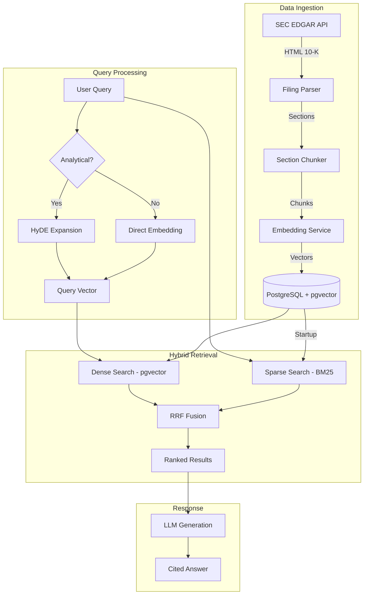

# System Overview

## High-Level Architecture

## Component Responsibilities

| Component | Responsibility | Key Tech |
|-----------|---------------|----------|
| EDGAR Client | Ticker→CIK resolution, filing download, caching | httpx, asyncio |
| Filing Parser | iXBRL HTML → sections, metadata extraction | BeautifulSoup, lxml |
| Section Chunker | Overlapping token-based splitting with dual content | tiktoken |
| Embedding Service | Batch sentence embedding, pgvector storage | sentence-transformers |
| BM25 Service | In-memory sparse index, tokenization, scoring | rank-bm25 |
| HyDE Service | Hypothetical document generation, graceful fallback | Ollama/Mistral |
| Retrieval Service | Orchestrates dense + sparse + RRF fusion | Custom RRF |
| FastAPI | REST API, dependency injection, async handlers | FastAPI, Uvicorn |

## Data Flow Summary

**Ingestion** (write path):
Ticker → EDGAR CIK → 10-K HTML → Section Detection → Chunking (220 tokens, 50 overlap) → MiniLM Embedding (384-dim) → pgvector + BM25 Index

**Search** (read path):
Query → [HyDE?] → Dense Search (pgvector cosine) + Sparse Search (BM25) → RRF Fusion → Top-K Results → [LLM Generation]
